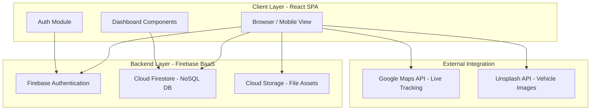
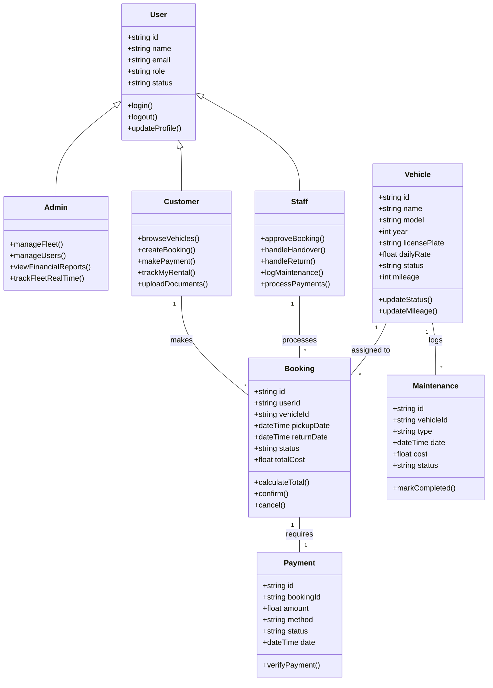
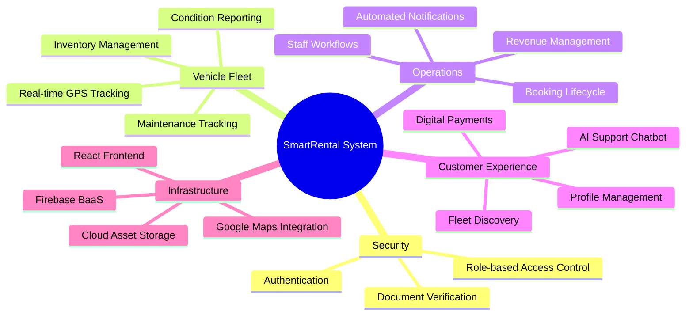
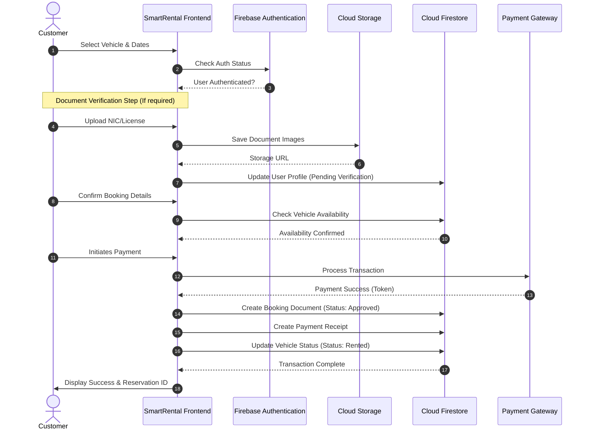
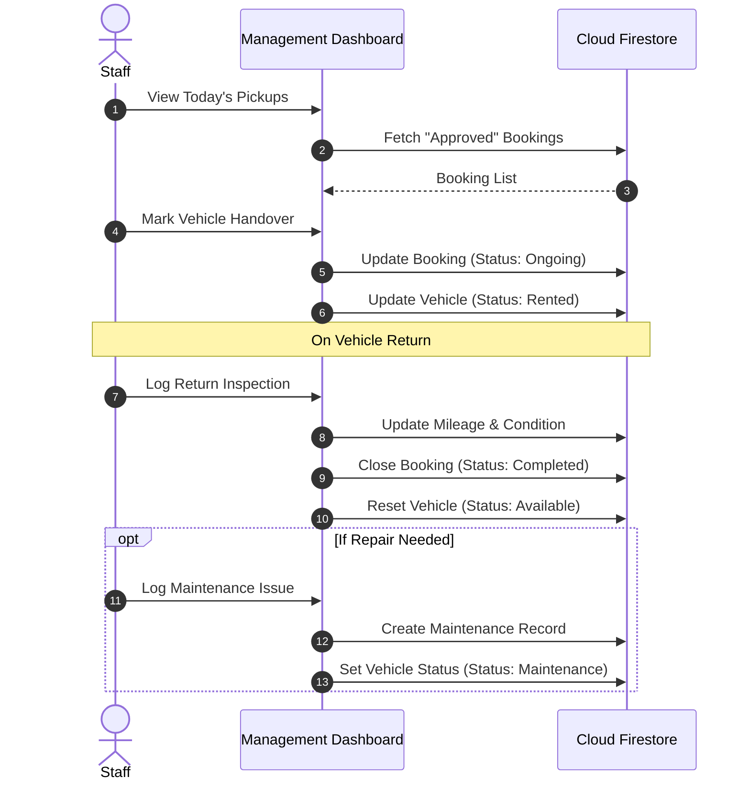
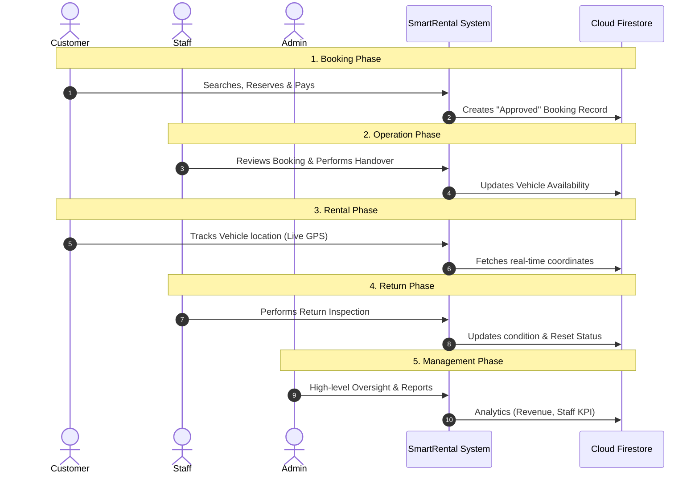

# SmartRental System Design Documentation

This document provides a comprehensive overview of the SmartRental system's architecture, functionality, and design diagrams.

---

## 1. System Architecture Diagram
The system follows a modern **3-Tier Architecture** utilizing **React** for the frontend and **Firebase** as a Serverless Backend-as-a-Service (BaaS).



---

## 2. Comprehensive Use Case Diagram
This diagram illustrates the functional boundaries of the system and how different users (Actors) interact with the SmartRental Core features.

```mermaid
useCaseDiagram
    actor "Administrator" as Admin
    actor "Staff Member" as Staff
    actor "Customer" as Customer

    package "SmartRental Ecosystem" {
        subgraph Customer_Actions [Rental Lifecycle]
            usecase "Search & Filter Vehicles" as C1
            usecase "Reserve Vehicle" as C2
            usecase "Make Digital Payment" as C3
            usecase "Track Active Rental (GPS)" as C4
        end

        subgraph Staff_Actions [Operational Logic]
            usecase "Review Booking Requests" as S1
            usecase "Perform Handover Inspection" as S2
            usecase "Process Return Inspection" as S3
            usecase "Update Vehicle Availability" as S4
        end

        subgraph Admin_Actions [High-Level Oversight]
            usecase "Access Management Reports" as A1
            usecase "Analyze Revenue Trends" as A2
            usecase "Monitor Staff Performance (KPI)" as A3
            usecase "Fleet & User Management" as A4
        end
    }

    %% Actor Relationships
    Customer --> C1
    Customer --> C2
    Customer --> C3
    Customer --> C4

    Staff --> S1
    Staff --> S2
    Staff --> S3
    Staff --> S4

    Admin --> A1
    Admin --> A2
    Admin --> A3
    Admin --> A4

    %% Logical Dependencies
    S1 ..> C2 : validates
    S2 ..> S1 : precedes
    S3 ..> S2 : follows
    A1 ..> S4 : tracks
```

---

## 3. Class Diagram (Advanced Data Model)
Detailed view of system entities, user roles, and their operational methods.



### 3.1 User Role Data Breakdown
While all users reside in the `users` collection in Firestore, the following fields are role-specific:

| Role | Shared Fields | Role-Specific Fields |
| :--- | :--- | :--- |
| **Customer** | id, name, email, phone, role, status, profileImage, address, nicNumber | totalBookings, totalSpent |
| **Staff** | id, name, email, phone, role, status, profileImage, address, nicNumber | department, joinDate |
| **Admin** | id, name, email, phone, role, status, profileImage, address, nicNumber | department, fullSystemAccess: true |

---

## 4. System Pages & Functionality

### Admin Module
| Page | Key Functions |
| :--- | :--- |
| **Overview** | KPI dashboards, Revenue charts, Rental trends. |
| **Vehicle Management** | Add/Edit/Delete vehicles, track mileage, change status. |
| **User Management** | Manage staff and customer accounts, roles, and status. |
| **Live Tracking** | Real-time GPS location of roaming fleet on Google Maps. |
| **Maintenance** | Schedule repairs, log costs, track vehicle health. |
| **Reports** | Financial summaries, staff performance, utilization metrics. |

### Staff Module
| Page | Key Functions |
| :--- | :--- |
| **Booking Requests** | Approve/Reject pending customer bookings. |
| **Pickup & Handover** | Digital checklist for vehicle handover, damage logs. |
| **Vehicle Returns** | Process returns, calculate extra mileage/damage fees. |
| **Maintenance Log** | Update status of vehicles in service. |
| **Payments** | Process manual payments and verify invoices. |

### Customer Module
| Page | Key Functions |
| :--- | :--- |
| **Fleet Browser** | Filter cars by type, fuel, price, and availability. |
| **Booking Window** | Calendar-based reservation with real-time cost estimation. |
| **My Bookings** | History of past rentals and management of active ones. |
| **Payments Portal** | View invoices and pay via digital methods. |
| **Live Tracking** | Real-time tracking of the reserved vehicle during delivery. |
| **Profile** | Manage personal info and driving license documents. |

---

## 5. Technology Stack Summary
- **Frontend**: React.js with TypeScript
- **Styling**: Tailwind CSS / Vanilla CSS
- **UI Components**: Radix UI
- **Icons**: Lucide-React
- **Database**: Google Firebase Firestore (NoSQL)
- **Auth**: Firebase Authentication
- **Storage**: Firebase Cloud Storage
- **Routing**: Client-side hash-based routing

---

## 6. System Mind Map
A visual hierarchy of the system's modules and features.



---

## 7. Box Mind Map (Structural Hierarchy)
A structured, block-based view of the system's organizational breakdown.

```mermaid
graph TD
    %% Base Center
    Root[SmartRental System]

    %% Level 1 Nodes
    Admin[Admin Management]
    Staff[Staff Operations]
    Cust[Customer Experience]
    Core[System Foundation]

    Root --- Admin
    Root --- Staff
    Root --- Cust
    Root --- Core

    %% Admin Features
    Admin --- A1[Fleet Inventory]
    Admin --- A2[User Access Control]
    Admin --- A3[Revenue Tracking]
    Admin --- A4[Real-time Monitoring]

    %% Staff Features
    Staff --- S1[Booking Approval]
    Staff --- S2[Handover Protocols]
    Staff --- S3[Return Processing]
    Staff --- S4[Maintenance Logs]

    %% Customer Features
    Cust --- C1[Vehicle Booking]
    Cust --- C2[Payment Gateway]
    Cust --- C3[GPS Tracking]
    Cust --- C4[Digital Documents]

    %% Core Infrastructure
    Core --- F1[Firebase Auth]
    Core --- F2[Firestore NoSQL]
    Core --- F3[Cloud Assets]
    Core --- F4[API Gateways]

    %% Styling
    style Root fill:#003366,stroke:#fff,stroke-width:4px,color:#fff
    style Admin fill:#e6f3ff,stroke:#003366,stroke-width:2px
    style Staff fill:#e6f3ff,stroke:#003366,stroke-width:2px
    style Cust fill:#e6f3ff,stroke:#003366,stroke-width:2px
    style Core fill:#f0f0f0,stroke:#333,stroke-width:2px

---

## 8. Entity Relationship Diagram (ERD)
This diagram illustrates the Firestore collection structure and the logical relationships between various entities in the SmartRental and Management ecosystem.

```mermaid
erDiagram
    USERS ||--o{ BOOKINGS : "places (Role: Customer)"
    USERS ||--o{ PAYMENTS : "makes (Role: Customer)"
    USERS ||--o{ STAFF_SALARY : "receives (Role: Staff)"
    USERS ||--o{ NOTIFICATIONS : "gets (All Roles)"
    USERS ||--o{ MAINTENANCE : "logs (Role: Staff)"
    USERS ||--o{ ROUTES : "monitors (Role: Admin)"
    
    VEHICLES ||--o{ BOOKINGS : "is_reserved_in"
    VEHICLES ||--o{ MAINTENANCE : "undergoes"
    
    BOOKINGS ||--|| PAYMENTS : "generates"
    
    DRIVERS ||--o{ ROUTES : "operates"
    DRIVERS ||--o{ ISSUES : "reports"
    
    BUSINESS_CUSTOMERS ||--o{ ORDERS : "places"
    ORDERS ||--o{ ISSUES : "experiences"

    USERS {
        string id PK
        string name
        string email
        string phone
        string role
        string status
        string joinDate
        string address
        string nicNumber
        string profileImage
        int totalBookings
        float totalSpent
        string department
    }

    VEHICLES {
        string id PK
        string name
        string model
        int year
        string licensePlate
        float dailyRate
        float hourlyRate
        float pricePerKm
        string type
        string fuelType
        int seats
        string transmission
        string status
        int mileage
        string image
        string description
        string color
        string engineCapacity
        string insuranceExpiry
        string lastServiceDate
    }

    BOOKINGS {
        string id PK
        string customerId FK
        string customerName
        string carId FK
        string carName
        string pickupDate
        string pickupTime
        string returnDate
        string status
        float estimatedCost
        float actualCost
        int totalDays
        boolean driverRequired
        string driverName
        timestamp createdAt
    }

    PAYMENTS {
        string id PK
        string invoiceNumber
        string bookingId FK
        string customerId FK
        float amount
        string status
        string method
        string date
        json breakdown
    }

    MAINTENANCE {
        string id PK
        string vehicleId FK
        string vehicleName
        string date
        string type
        string description
        float cost
        string status
        string nextServiceDate
    }

    DRIVERS {
        string id PK
        string name
        string email
        string licenseNumber
        string status
        string assignedVehicle
        float rating
        string center
    }

    ORDERS {
        string id PK
        string customerName FK
        string salesRep
        string date
        string deliveryAddress
        json items
        float totalAmount
        string status
        string priority
    }

    PRODUCTS {
        string id PK
        string name
        string sku
        string category
        float unitPrice
        int stock
        string rdcLocation
        string status
        string supplier
    }

    BUSINESS_CUSTOMERS {
        string id PK
        string name
        string email
        string phone
        string address
        float totalValue
        float creditLimit
        string status
    }

    ROUTES {
        string id PK
        string name
        int stops
        string distance
        string estimatedTime
        string assignedDriver FK
        string status
    }

    ISSUES {
        string id PK
        string driverId FK
        string orderId FK
        string issue
        timestamp reportedAt
        string severity
        string status
        string resolution
    }

    STAFF_SALARY {
        string id PK
        string staffId FK
        string name
        float baseSalary
        float netSalary
        string month
        string status
        string paidDate
    }

    NOTIFICATIONS {
        string id PK
        string userId FK
        string title
        string message
        string type
        boolean read
        timestamp createdAt
    }

    BRANCHES {
        string id PK
        string name
        string city
        string phone
        string managerName
        int totalVehicles
        string status
    }
```

---

## 9. Sequence Diagrams
These diagrams illustrate the dynamic behavior of the system, focusing on key business processes and data flow between the client and Firebase services.

### 9.1 Vehicle Booking & Payment Workflow
This diagram shows the step-by-step process of a customer reserving a vehicle and completing the digital payment.



### 9.2 Staff Handover & Maintenance Flow
Illustrates how the operational staff manages the vehicle lifecycle.



### 9.3 Comprehensive End-to-End System Lifecycle
This diagram demonstrates how all three user roles (Customer, Staff, and Admin) interact within a single end-to-end business cycle.



---

## 10. Role-Based Operations Summary
A consolidated view of specific responsibilities for each system stakeholder.

| Role | Key Responsibilities | Primary Goal |
| :--- | :--- | :--- |
| **Customer** | **Search, Reserve, Pay, and Track.** Browse the fleet, book vehicles, make digital payments, and monitor their rental location in real-time. | Seamless Rental Experience |
| **Staff** | **Review, Handover, Inspect, and Update.** Process booking requests, handle vehicle pickups/returns, log maintenance, and ensure vehicle availability is accurate. | Operational Excellence |
| **Admin** | **Oversight, Analytics, and Management.** Monitor revenue trends, analyze staff performance KPIs, manage the fleet inventory, and oversee user roles. | Strategic Growth & Stability |

---
